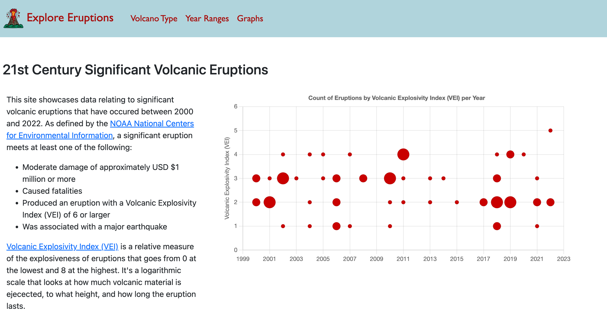
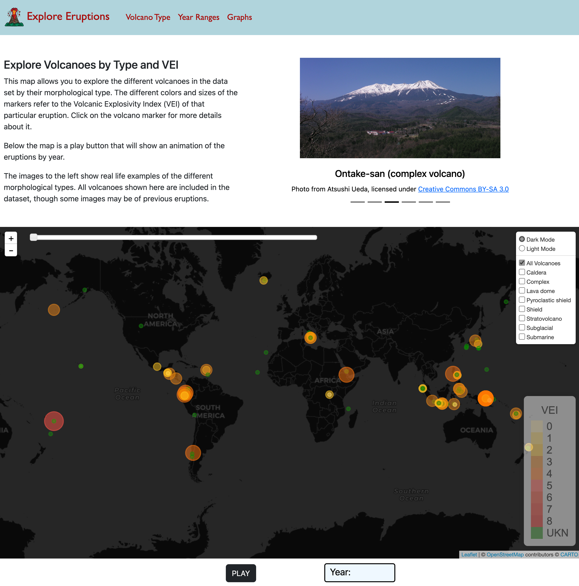
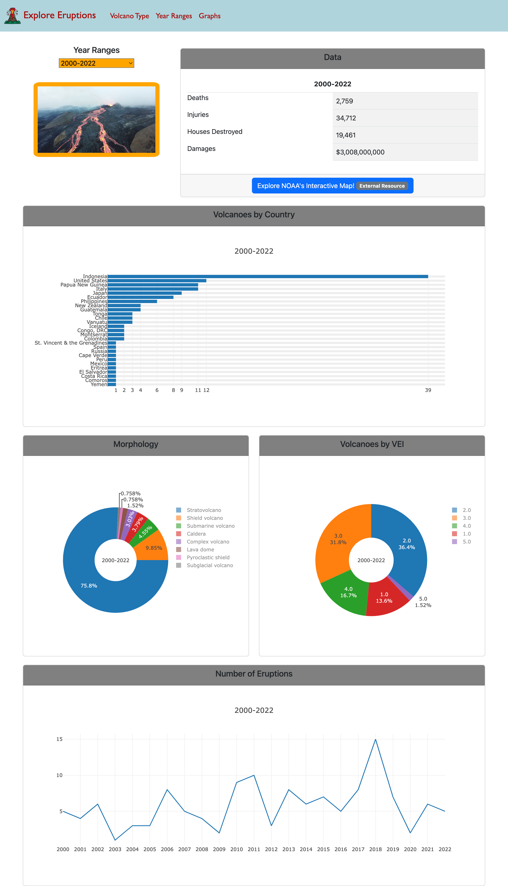
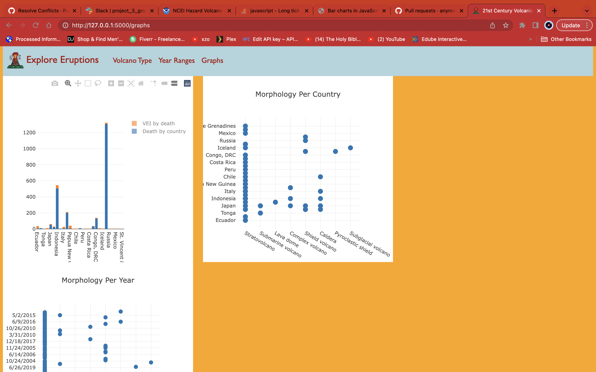

# 21st Century Significant Volcanic Eruptions
 

## Overview 
For Project 3 of the UMN Data Analysis Boot Camp, we constructed a full-stack website to visualize data on significant volcanic eruptions in the 21st century. The data was aquired from the [National Oceanographic and Atmospheric Administration](https://www.ngdc.noaa.gov/hazard/volcano.shtml).  
### Team
* Amanda Nyren
* William Vann
* Sanoo Singh
* Mauvonte Roberts

Our site pulls data from the NOAA API and loads it into a MongoDB. Flask routes render all the webpages as well as serving the data used to create the graphs and maps. We used Bootstrap to layout the webpages as well as the plotly, leaflet, and chart.js libraries.  

## Instructions
#### Requirements
* Python 3.8
* MongoDB
* Packages: 
    * Flask
    * PyMongo
    * Pandas
    * requests

#### Steps to run
1. Navigate to the repo in a terminal/gitbash window
1. Run `python app.py` to start the Flask server
1. Navigate to `http://127.0.0.1:5000/` in your browser
1. Explore!

## Screenshots

  
  

